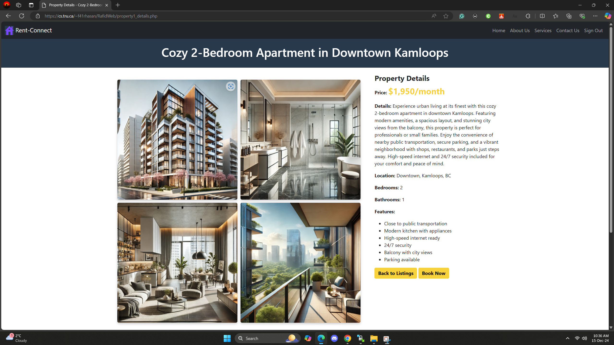

# Rent Connect Web

The **Rent Connect Web** project is a web application designed to connect renters and property owners seamlessly. This platform allows users to search for rental properties, manage listings, and streamline the renting process through a user-friendly interface.

---

## About the Project

This project was built to:
- Help property owners list their available rental properties online.
- Provide renters with an easy-to-navigate platform to search for properties.
- Simplify the property management and tenant search process.

---

## Features

- **Property Listings**:
  - View and manage property listings with detailed information.
- **Search Functionality**:
  - Search for properties based on location, price, and features.
- **User Authentication**:
  - Secure login and registration system for property owners and renters.
- **Responsive Design**:
  - Fully optimized for desktop, tablet, and mobile devices.
- **Performance Optimization**:
  - Fast loading times and smooth navigation.

---

## Screenshots





---

## YouTube Demo

Check out the project in action on YouTube:

[**YouTube Demo**](https://youtu.be/YOUR_VIDEO_LINK)


---


## Technologies Used

- **HTML5**  
- **CSS3**  
- **JavaScript**  
- **PHP** (Backend)  
- **MySQL** (Database)

---

## How to Run the Project

1. Clone the repository:
   ```bash
   git clone https://github.com/Raf1dhasan/rent-connect-web.git
2. Set up a local server using XAMPP or WAMP.
3. Import the database:
   Locate the SQL file in the project folder and import it into your MySQL database.
4. Update the database credentials in the project files.
5. Run the project in a browser:
http://localhost/rent-connect-web

## What I Did
- Designed the website layout using HTML, CSS, and JavaScript.
- Developed backend functionalities using PHP and integrated a MySQL database.
- Created a responsive design for seamless use across devices.
- Added search and authentication features for users.

## What I Learned
- Gained hands-on experience with backend development using PHP.
- Enhanced my understanding of database management with MySQL.
- Learned how to optimize website performance and responsiveness.
- Improved my skills in creating user-friendly interfaces for web applications.

## Future Improvements
- Add a payment gateway for online rent payments.
- Implement a chat system for direct communication between property owners and renters.
- Enhance property search with filters like amenities, property type, and more.
- Develop an admin panel to manage users and listings efficiently.

## Contact
If you'd like to learn more about this project or discuss opportunities, feel free to reach out:

- Email: rafidhasan202@gmail.com


